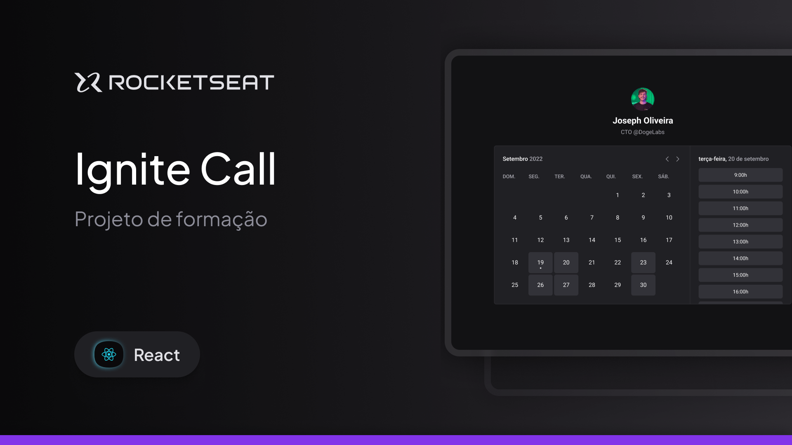

## Prisma

Docs: https://www.prisma.io/docs/guides/nextjs

Comando para iniciar o Prisma: `npx prisma init --datasource-provider SQLite`

Comando pra rodar a migration: `npx prisma migrate dev`

Comando pra rodar o Prisma Studio: `npx prisma studio`

Comando utilizado para rodar o Docker: `docker run --name mysql -e MYSQL_ROOT_PASSWORD=docker -p 3306:3306 mysql:latest`

## NextAuth

Comando pra rodar o gerar um hash para ser colocado no env Auth: `openssl rand -base64 32`

## GOOGLE

- Ir em https://console.developers.google.com/
- Criar um novo projeto
- Ir em "OAuth Consent Screen" e configurar o app
- Ir em "Credentials" e criar um "OAuth 2.0 Client IDs"
- Colocar o Client ID e Client Secret no .env
- Colocar o seguinte redirect URI: `http://localhost:3000/api/auth/callback/google`
- Ir em "OAuth Consent Screen" e publicar o app (mesmo em modo de teste)
- Ir em Apis e Servicos Ativados e ativar a Google Calendar API
